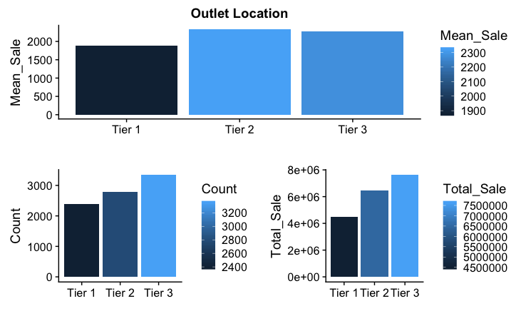
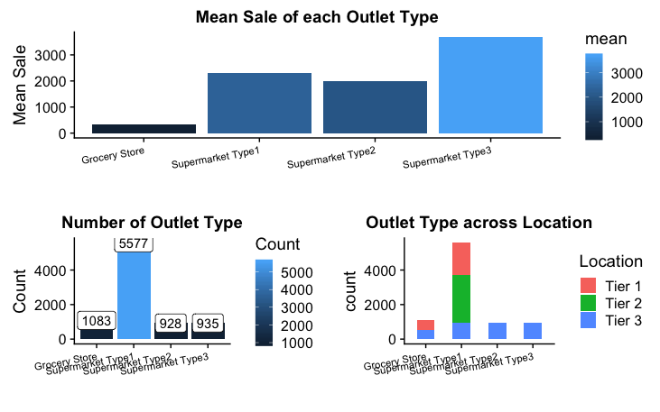
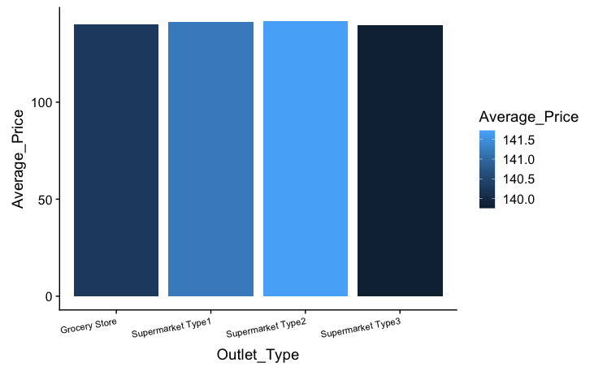
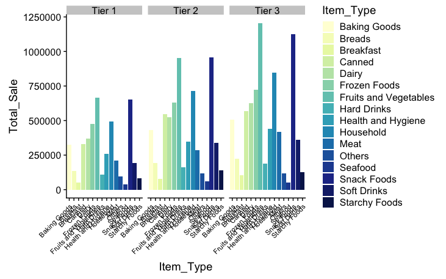
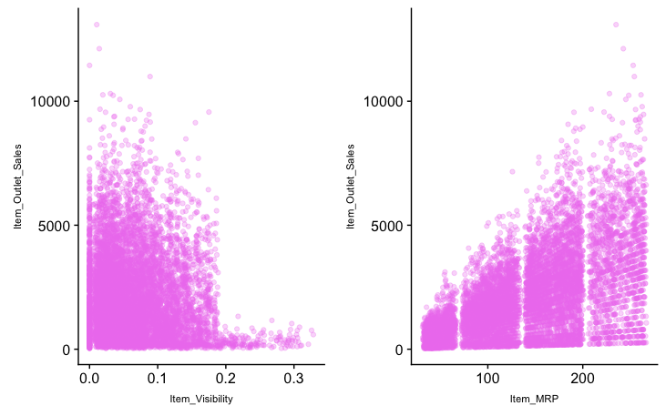
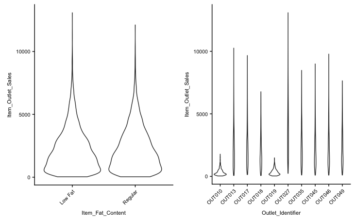

# Sale Prediction

## Problem Statement
The data scientists at BigMart have collected sales data for 1559 products across 10 stores in different cities for the year 2013. Now each product has certain attributes that sets it apart from other products. Same is the case with each store.

The goal of this post is to extract some hidden information behind the featurs.


## Data Description
We have train (8523) and test (5681) data set, train data set has both input and output variable(s).

| Features | Description |
| --- | --- |
| Item_Identifier | Unique product ID |
| Item_Weight | Weight of product |
| Item_Fat_Content | Whether the product is low fat or not |
| Item_Visibility | The % of total display area of all products in a store allocated to the particular product|
| Item_Type | The category to which the product belongs|
| Item_MRP | Maximum Retail Price (list price) of the product |
| Outlet_Identifier | Unique store ID |
| Outlet_Establishment_Year | The year in which store was established |
| Outlet_Size | The size of the store in terms of ground area covered |
| Outlet_Location_Type | The type of city in which the store is located |
| Outlet_Type | Whether the outlet is just a grocery store or some sort of supermarket |
| Item_Outlet_Sales | Sales of the product in the particulat store. This is the outcome variable to be predicted | 

More details can be found at [Problem Statement](https://datahack.analyticsvidhya.com/contest/practice-problem-big-mart-sales-iii/)

## Hypothesis

## Load the data and package

```
library(data.table) # used for reading and manipulation of data
library(dplyr)      # used for data manipulation and joining
library(ggplot2)    # used for ploting 
library(caret)      # used for modeling
library(corrplot)   # used for making correlation plot
library(cowplot)    # used for combining multiple plots 
library(RColorBrewer)

train = fread("Train_UWu5bXk.csv")
```

## Exploratory Data Analysis
### Dependent Variables
```
ggplot(train) + 
  geom_density(aes(Item_Outlet_Sales), fill = "lightblue") +
  xlab("Item_Outlet_Sales")
```


We can clearly see that it is a right skewd variable and would need some data transformation to treat its skewness such as cube-root transformation. Then it becomes,


### Independent Variables
**Fat Content and Outlet Size**


In the Item_Fat_content figure above, ‘LF’, ‘low fat’, and ‘Low Fat’ are the same category and can be combined into one. Similarly we can be done for ‘reg’ and ‘Regular’ into one. Therefore, we use below codes to transform.

```
combi = combi %>%
  mutate(
    Item_Fat_Content = case_when(
      .$Item_Fat_Content == 'LF' ~ 'Low Fat',
      .$Item_Fat_Content == 'low fat' ~ 'Low Fat',
      .$Item_Fat_Content == 'reg' ~ 'Regular',
      TRUE ~ .$Item_Fat_Content
    )
  )
```

In Outlet_Size’s plot, many observations are blank or missing. We can fill these values with the mean of the same product.

```
train = train %>%
  mutate(
    Outlet_Size = case_when(
      .$Outlet_Size == 'Small' ~ 1,
      .$Outlet_Size == 'Medium' ~ 2,
      .$Outlet_Size == 'High' ~ 3
    )
  ) 

missing_index = which(is.na(train$Outlet_Size))
for(i in missing_index){
  
  item = train$Item_Identifier[i]
  train$Outlet_Size[i] = mean(train$Outlet_Size[train$Item_Identifier == item], na.rm = T)
  
}
```

**Establishment Year**


Lesser number of observations in the data for the outlets established in the year 1998 as compared to the other years. It might be caused by poor sales at that year. Therefore, we plot the mean sale in each year and find that the sales in 1998 was indeed lesser than other years.

Also, by looking at the bottom right plot, we can find that in each year, the company tends to establish
outlets in one location.

**Outlet Location**



Large number of outlets locate at Tier3 so the total sales in Tier3 is the largest. However, the average sales in Tier2 is the largest. Maybe the company can establish more outlets at Tier2.

**Outlet Type**



Supermarket Type 1 seems to be the most popular category of Outlet_Type. So we might expect that the Supermarket Type 1 should have the best sales, however, we find that Supermarket Type 3 has the best sales.

Let's check whether the large amount of sales in Supermarket Type3 is caused by higher price of the products.



We can find that the average prices for each kind of outlets are similar, so we can conclude that people tend to shop at Supermarket Type3.

**Item Type**



From the above plot, we can find that Fruit and Vegetable and Snack Foods have the higher sales no matter in which location.

**Item Visibility anf Item MRP**



In Item_Visibility vs Item_Outlet_Sales, there is a string of points at Item_Visibility = 0.0 which seems strange as item visibility cannot be completely zero. We can fill these values with the mean of visibility of the same product.

```
# replacing 0 in Item_Visibility with mean
zero_index = which(train$Item_Visibility == 0)
for(i in zero_index){
  
  item = train$Item_Identifier[i]
  train$Item_Visibility[i] = mean(train$Item_Visibility[train$Item_Identifier == item], na.rm = T)
  
}

```

In the plot of Item_MRP vs Item_Outlet_Sales, we can clearly see 4 segments of prices that can be used in feature engineering to create a new variable.

```
train = train %>%
  mutate(
    Item_MRP_clusters = case_when(
      .$Item_MRP < 69 ~ '1st',
      .$Item_MRP >=69 & .$Item_MRP < 136 ~ '2nd',
      .$Item_MRP >=136 & .$Item_MRP < 203 ~ '3rd',
      TRUE ~ '4th'
    )
  )
```

**Fat Content and Outlet Identifier**



From the Fat Content plot, we might conclude that the fat content have little impact on the prediction of the sales.
From the Outlet Identifier plot, we can see that products - OUT010 and OUT019 have relatively small sales.

##Summary
