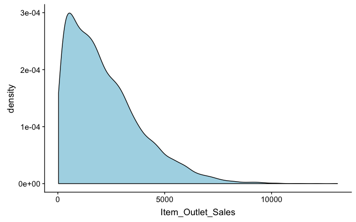
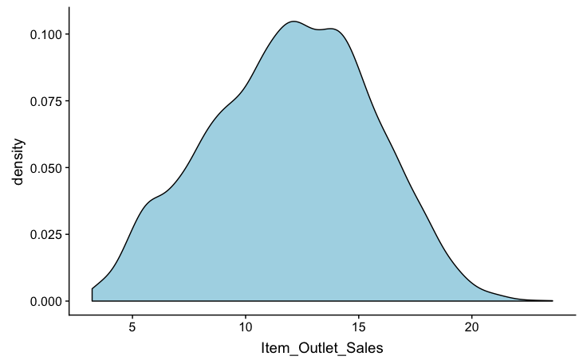
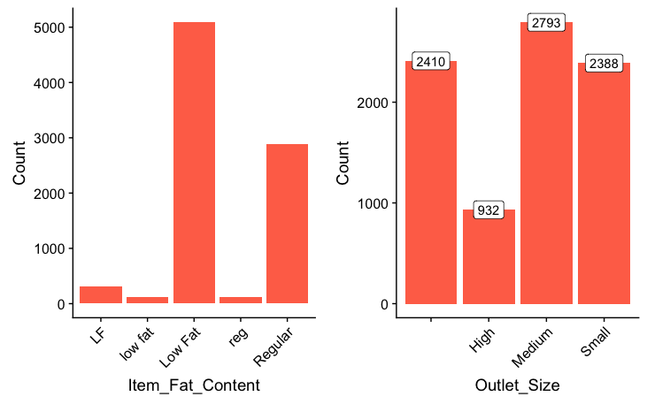
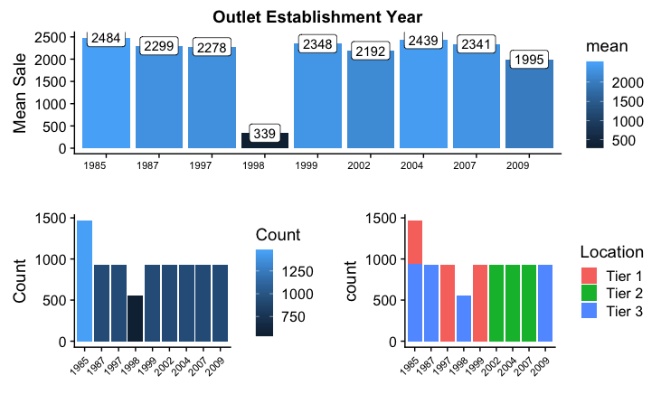

# Sale Prediction

## Problem Statement
The data scientists at BigMart have collected sales data for 1559 products across 10 stores in different cities for the year 2013. Now each product has certain attributes that sets it apart from other products. Same is the case with each store.

The goal of this post is to extract some hidden information behind the featurs.


## Data Description
We have train (8523) and test (5681) data set, train data set has both input and output variable(s).

| Features | Description |
| --- | --- |
| Item_Identifier | Unique product ID |
| Item_Weight | Weight of product |
| Item_Fat_Content | Whether the product is low fat or not |
| Item_Visibility | The % of total display area of all products in a store allocated to the particular product|
| Item_Type | The category to which the product belongs|
| Item_MRP | Maximum Retail Price (list price) of the product |
| Outlet_Identifier | Unique store ID |
| Outlet_Establishment_Year | The year in which store was established |
| Outlet_Size | The size of the store in terms of ground area covered |
| Outlet_Location_Type | The type of city in which the store is located |
| Outlet_Type | Whether the outlet is just a grocery store or some sort of supermarket |
| Item_Outlet_Sales | Sales of the product in the particulat store. This is the outcome variable to be predicted | 

More details can be found at [Problem Statement](https://datahack.analyticsvidhya.com/contest/practice-problem-big-mart-sales-iii/)

## Hypothesis

## Load the data and package

```
library(data.table) # used for reading and manipulation of data
library(dplyr)      # used for data manipulation and joining
library(ggplot2)    # used for ploting 
library(caret)      # used for modeling
library(corrplot)   # used for making correlation plot
library(cowplot)    # used for combining multiple plots 
library(RColorBrewer)

train = fread("Train_UWu5bXk.csv")
```

## Exploratory Data Analysis
#### Dependent Variables
```
ggplot(train) + 
  geom_density(aes(Item_Outlet_Sales), fill = "lightblue") +
  xlab("Item_Outlet_Sales")
```


We can clearly see that it is a right skewd variable and would need some data transformation to treat its skewness such as cube-root transformation. Then it becomes,



#### Independent Variables
**Fat Content and Outlet Size**


- In the Item_Fat_content figure above, ‘LF’, ‘low fat’, and ‘Low Fat’ are the same category and can be combined into one. Similarly we can be done for ‘reg’ and ‘Regular’ into one. Therefore, we use below codes to transform

```
combi = combi %>%
  mutate(
    Item_Fat_Content = case_when(
      .$Item_Fat_Content == 'LF' ~ 'Low Fat',
      .$Item_Fat_Content == 'low fat' ~ 'Low Fat',
      .$Item_Fat_Content == 'reg' ~ 'Regular',
      TRUE ~ .$Item_Fat_Content
    )
  )
```

- In Outlet_Size’s plot, many observations are blank or missing. We can fill these values with the mean of the same product

```
train = train %>%
  mutate(
    Outlet_Size = case_when(
      .$Outlet_Size == 'Small' ~ 1,
      .$Outlet_Size == 'Medium' ~ 2,
      .$Outlet_Size == 'High' ~ 3
    )
  ) 

missing_index = which(is.na(train$Outlet_Size))
for(i in missing_index){
  
  item = train$Item_Identifier[i]
  train$Outlet_Size[i] = mean(train$Outlet_Size[train$Item_Identifier == item], na.rm = T)
  
}
```

**Establishment Year**



Lesser number of observations in the data for the outlets established in the year 1998 as compared to the other years. It might be caused by poor sales at that year. Therefore, we plot the mean sale in each year and find that the sales in 1998 was indeed lesser than other years.

Also, by looking at the bottom right plot, we can find that in each year, the company tends to establish
outlets in one location

### Bivariate Analysis
## Missing Value Treatment
## Feature Engineering
## Encoding Categorical Variables
### Label Encoding
### One Hot Encoding
## PreProcessing Data
##Modeling
### Linear Regression
### Regularized Linear Regression
### RandomForest
### XGBoost
##Summary
