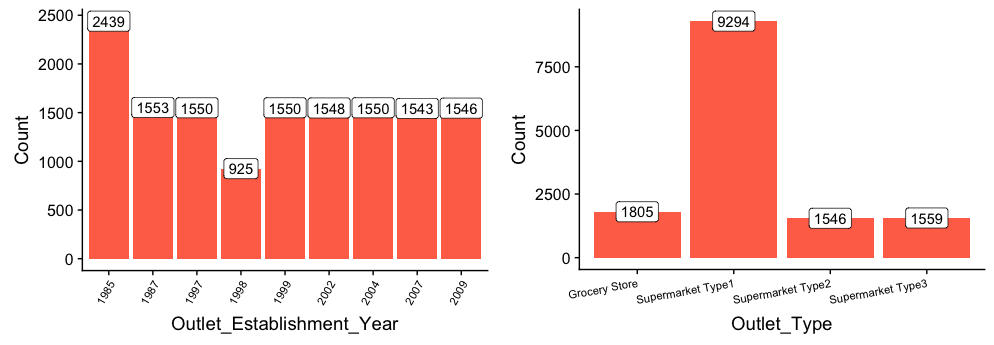

# Sale Prediction

## Problem Statement
The data scientists at BigMart have collected sales data for 1559 products across 10 stores in different cities for the year 2013. Now each product has certain attributes that sets it apart from other products. Same is the case with each store.

The aim is to build a predictive model to find out the sales of each product at a particular store so that it would help the decision makers at BigMart to find out the properties of any product or store, which play a key role in increasing the overall sales.

More details can be found at [Problem Statement](https://datahack.analyticsvidhya.com/contest/practice-problem-big-mart-sales-iii/)

## Data Description
We have train (8523) and test (5681) data set, train data set has both input and output variable(s).

| Features | Description |
| --- | --- |
| Item_Identifier | Unique product ID |
| Item_Weight | Weight of product |
| Item_Fat_Content | Whether the product is low fat or not |
| Item_Visibility | The % of total display area of all products in a store allocated to the particular product|
| Item_Type | The category to which the product belongs|
| Item_MRP | Maximum Retail Price (list price) of the product |
| Outlet_Identifier | Unique store ID |
| Outlet_Establishment_Year | The year in which store was established |
| Outlet_Size | The size of the store in terms of ground area covered |
| Outlet_Location_Type | The type of city in which the store is located |
| Outlet_Type | Whether the outlet is just a grocery store or some sort of supermarket |
| Item_Outlet_Sales | Sales of the product in the particulat store. This is the outcome variable to be predicted | 

## Hypothesis

## Load and Combine the data

```
train = fread("Train_UWu5bXk.csv")
test = fread("Test_u94Q5KV.csv")

## add Item_Outlet_Sales to test data
test = test %>% 
  mutate(Item_Outlet_Sales = NA)

combi = rbind(train, test) # combining train and test datasets
```

## Exploratory Data Analysis
### Univariate Analysis
#### Target Variables
```
ggplot(train) + 
  geom_density(aes(Item_Outlet_Sales), fill = "lightblue") +
  xlab("Item_Outlet_Sales")
```


We can clearly see that it is a right skewd variable and would need some data transformation to treat its skewness such as cube-root transformation. Then it becomes,


#### Independent Variables (Numerical)


- There seems to be no clear pattern in Item_Weight.
- Item_Visibility is right-skewed and should be transformed.
- We can clearly see 4 different distributions for Item_MRP. It is an interesting insight.

#### Independent Variables (Categorical)


- In the Item_Fat_content figure above, ‘LF’, ‘low fat’, and ‘Low Fat’ are the same category and can be combined into one. Similarly we can be done for ‘reg’ and ‘Regular’ into one. Therefore, we use below codes to transform

```
combi = combi %>%
  mutate(
    Item_Fat_Content = case_when(
      .$Item_Fat_Content == 'LF' ~ 'Low Fat',
      .$Item_Fat_Content == 'low fat' ~ 'Low Fat',
      .$Item_Fat_Content == 'reg' ~ 'Regular',
      TRUE ~ .$Item_Fat_Content
    )
  )
```

- In Outlet_Size’s plot, for 4016 observations, Outlet_Size is blank or missing.We will check for this in the bivariate analysis to substitute the missing values in the Outlet_Size

Let's check the remaining categorical variables,



- Lesser number of observations in the data for the outlets established in the year 1998 as compared to the other years.
- Supermarket Type 1 seems to be the most popular category of Outlet_Type.

### Bivariate Analysis
## Missing Value Treatment
## Feature Engineering
## Encoding Categorical Variables
### Label Encoding
### One Hot Encoding
## PreProcessing Data
##Modeling
### Linear Regression
### Regularized Linear Regression
### RandomForest
### XGBoost
##Summary
